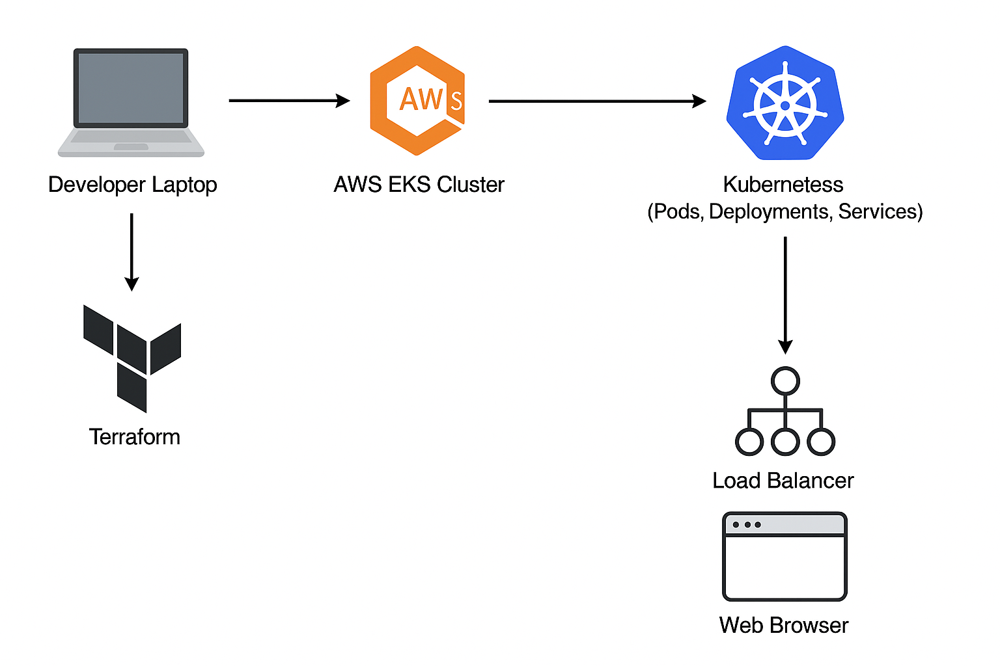
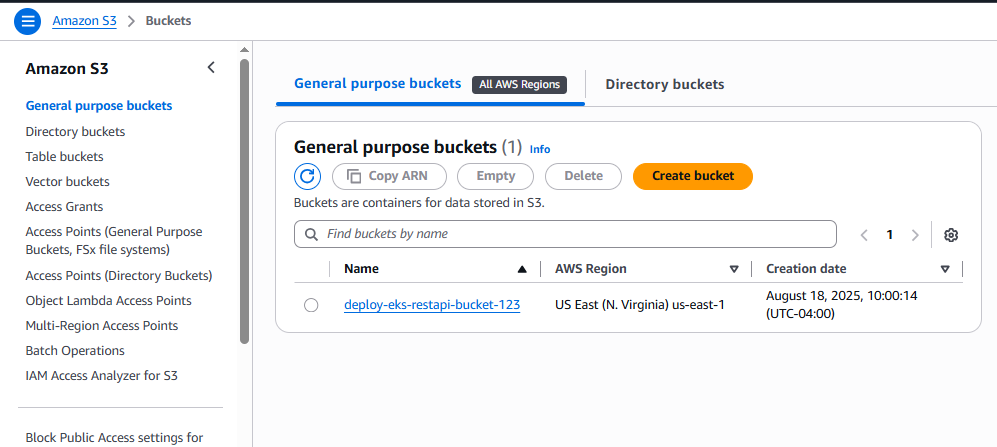

# 🚀 AWS EKS Deployment with Terraform, Docker, and Kubernetes

This project demonstrates how to **containerize a simple application using Docker**, and deploy it to **Amazon Elastic Kubernetes Service (EKS)** using **Terraform** and Kubernetes manifests.  

It is designed as a **portfolio-ready DevOps/CloudOps project** to showcase skills in **Infrastructure as Code (IaC), Kubernetes orchestration, AWS services, and CI/CD readiness**.

---

## 📌 Project Overview

Modern cloud applications need scalability, resilience, and automation. Running applications manually on servers is error-prone and inefficient.  

This project solves that by:

- Packaging the application in a **Docker container**.  
- Deploying it to an **EKS cluster** provisioned with **Terraform (IaC)**.  
- Managing workloads using **Kubernetes manifests (YAML)**.  
- Exposing the app to the internet via a **Kubernetes LoadBalancer Service**.  

---

## 🏗️ Architecture



## ⚙️ Tech Stack

- PS: Please use the resource provided to set up an account in [Amazon Cloud](https://aws.amazon.com/resources/create-account/)

- **AWS EKS** – Managed Kubernetes service
- **Terraform** – Infrastructure as Code (IaC)
- **Docker** – Containerization
- **Python** - Backbone of the application's runtime logic
- **Kubernetes** – Orchestration (Deployments, Services)
- **AWS IAM & VPC** – Networking & security for EKS
- **GitHub Actions (optional)** – CI/CD automation

---

## 🚀 Deployment Steps

### Setting up myenv in Home Directory

1. Navigate to your home directory.

    ```bash
    cd /home/$USER
    ```

2. Create a personalized directory. E.g. `**devops-engineer**`

    ```bash
    mkdir devops-engineer
    ```

3. Go into the personalize directory

    ```bash
    cd devops-engineer
    ```

4. Set up myenv

    ```bash
    sudo apt update && sudo apt install -y python3-venv && python3 -m venv myenv
    source myenv/bin/activate
    ```

### Setup AWS CLI in Ubuntu

1. Update Package Lists and Install Dependencies

    ```bash
    cd /home/$USER
    sudo apt update
    sudo apt install -y curl unzip
    ```

2. Download the AWS CLI v2 Installer

    ```bash
    curl "https://awscli.amazonaws.com/awscli-exe-linux-x86_64.zip" -o "awscliv2.zip"
    ```

3. Extract the Installer

    ```bash
    unzip awscliv2.zip
    ```

4. Run the Installation Script

    ```bash
    sudo ./aws/install
    ```

5. Verify the Installation

    ```bash
    aws --version
    ```

6. Configure the AWS CLI

    ```bash
    aws configure

    Enter AccessKey: your AWS account access key
    Enter SecretKey: your AWS account secret key
    Enter Region: your assigned region
    Enter Format: json
    ```
---

## 📂 Project Structure

```bash
        aws-eks-restapi/
├── app/
│   ├── src/
│   │   └── app.py
│   ├── requirements.txt
│   └── Dockerfile
├── infra/terraform/
│   ├── backend.tf
│   ├── main.tf
│   ├── variables.tf
│   └── outputs.tf
├── k8s/
│   ├── namespace.yaml
│   ├── configmap.yaml
│   ├── secret.example.yaml
│   ├── deployment.yaml
│   └── service.yaml
└── .github/workflows/   # we’ll add later

```

### 2 Write the minimal API (Flask)

1. Write the minimal API (Flask), `app/src/app.py`

```py
from flask import Flask, request, jsonify
import os, time
import psycopg2
from prometheus_client import Counter, generate_latest
from dotenv import load_dotenv

app = Flask(__name__)

REQS = Counter('api_requests_total', 'Total API requests', ['endpoint'])

def db_conn():
    return psycopg2.connect(
        host=os.environ['DB_HOST'],
        dbname=os.environ['DB_NAME'],
        user=os.environ['DB_USER'],
        password=os.environ['DB_PASSWORD'],
        port=int(os.environ.get('DB_PORT', 5432)),
        connect_timeout=5
    )

def ensure_table():
    for _ in range(10):
        try:
            with db_conn() as conn, conn.cursor() as cur:
                cur.execute("""CREATE TABLE IF NOT EXISTS items(
                    id SERIAL PRIMARY KEY,
                    name TEXT NOT NULL,
                    created_at TIMESTAMP DEFAULT NOW()
                );""")
                conn.commit()
            return
        except Exception:
            time.sleep(2)
ensure_table()

# --- NEW ROOT ROUTE ---
@app.get("/")
def index():
    REQS.labels('/').inc()
    return jsonify(message="Welcome to the Flask REST API! Try /health, /items, or /metrics.")
# --- END NEW ROOT ROUTE ---

@app.get("/health")
def health():
    REQS.labels('/health').inc()
    return jsonify(status="ok")

@app.get("/items")
def list_items():
    REQS.labels('/items').inc()
    with db_conn() as conn, conn.cursor() as cur:
        cur.execute("SELECT id, name, created_at FROM items ORDER BY id DESC;")
        rows = cur.fetchall()
    return jsonify([{"id": r[0], "name": r[1], "created_at": r[2].isoformat()} for r in rows])

@app.post("/items")
def create_item():
    REQS.labels('/items').inc()
    name = request.json.get("name")
    if not name: return jsonify(error="name required"), 400
    with db_conn() as conn, conn.cursor() as cur:
        cur.execute("INSERT INTO items(name) VALUES (%s) RETURNING id;", (name,))
        item_id = cur.fetchone()[0]
        conn.commit()
    return jsonify(id=item_id, name=name), 201

@app.get("/metrics")
def metrics():
    return generate_latest(), 200, {'Content-Type': 'text/plain; version=0.0.4; charset=utf-8'}

if __name__ == "__main__":
    app.run(host="0.0.0.0", port=5000)

```

### Variables Creation Best Practices

The variables in the db_conn function `DB_HOST`, `DB_NAME`, `DB_USER`, `DB_PASSWORD`, and `DB_PORT` are retrieved from `os.environ`. This means they are expected to be configured as environment variables in the environment where your application is running. Remember to change the values based on your setup.

_**.env.example**_

```bash

    # .env.example

    # Environment variables required by the application.
    # Copy this file to .env and fill in the values for local development.

    DB_HOST=db
    DB_NAME=mydatabase
    DB_USER=myuser
    DB_PASSWORD=mypassword
    DB_PORT=5432
```

_**.env**_

```bash
# .env

# This file is for local development environment variables.
# It should NOT be committed to version control.

DB_HOST=
DB_NAME=
DB_USER=
DB_PASSWORD=
DB_PORT=
```


2. Update the requirements `app/requirements.txt` based on the import functions from `app.py`.

    ```ini
        flask==3.0.3
        psycopg2-binary==2.9.9
        prometheus-client==0.20.0
        python-dotenv
    ```

### 3 Dockerize & test locally

3. Create the `Dockerfile`

```dockerfile
# Use a slim, official Python image for a smaller footprint.
# 3.12 is a good choice as it's a recent, stable version.
FROM python:3.12-slim

# Set the working directory inside the container.
# All subsequent commands will be run from this directory.
WORKDIR /app

# Set environment variables for better Python and Docker integration.
# This ensures that logs are output in real-time, which is crucial for
# debugging and log collectors.
ENV PYTHONUNBUFFERED=1

# First, copy only the requirements file. This allows Docker to cache
# the layer of dependencies. If requirements.txt doesn't change,
# the pip install step will be skipped on subsequent builds.
COPY requirements.txt .

# Install Python dependencies. Using --no-cache-dir reduces the image size.
RUN pip install --no-cache-dir -r requirements.txt

# Copy the application code. This is done after installing dependencies
# to leverage Docker's build cache. If only the code changes, this layer
# will be rebuilt, but the dependencies layer will not.
# We are copying a specific src directory, which is a good practice.
COPY src/ ./src

# Expose the port that the application listens on.
# This is a documentation step; it doesn't publish the port.
EXPOSE 5000

# Define the command to run the application when the container starts.
# We explicitly point to the app.py file within the src directory.
CMD ["python", "src/app.py"]
```

4. Build & run (local test without DB just to see /health):

```bash
cd app
docker build -t eks-rest-api:dev .
docker-compose up --build (old version) OR
docker compose up --build (new version)
# visit http://localhost:5000/health (should return {"status":"ok"})

Run CTRL + C to stop the docker containers
```
---

### Create the s3 bucket using CloudFormation

```bash
aws s3 mb s3://deploy-eks-restapi-bucket-123 --region us-east-1  # Name should be unique
```



### Create DynamoDB Table using CloudFormation

```bash
aws dynamodb create-table \
  --table-name terraform-eks-restapi-lock \
  --attribute-definitions AttributeName=LockID,AttributeType=S \
  --key-schema AttributeName=LockID,KeyType=HASH \
  --provisioned-throughput ReadCapacityUnits=5,WriteCapacityUnits=5 \
  --region us-east-1
```

### Create a Helper Script TF_VAR

To avoid typing this every time, you can create a small shell script in your Terraform directory.

```bash
#!/bin/bash

# Load environment variables from .env file
# This assumes .env is in the parent directory of your terraform code
# Adjust path if your .env file is elsewhere
if [ -f "./.env" ]; then # Adjust this path to correctly point to your .env file
  export $(grep -v '^#' ./.env | xargs)
fi

# Set TF_VAR_db_password from the DB_PASSWORD loaded from .env
export TF_VAR_db_password=$DB_PASSWORD

# Execute the terraform command
terraform "$@"
```
Make sure the if [ -f ./.env ] path correctly points to your actual .env file relative to where you run this script.

Make the script executable

```bash
chmod +x run_terraform.sh
```
And run your Terraform commands through it:

```bash
./run_terraform.sh plan
./run_terraform.sh apply
```
---

### 4 Provision AWS infra with Terraform

Create the Terraform files in `infra/terraform/`

1. **`backend.tf`** - Configure remote state storage in S3.

```hcl
terraform {
      backend "s3" {
        bucket = "deploy-aws-eks-restapi-repo"
        key = "eks-restapi/terraform.tfstate"
        region = "us-east-1"
        encrypt = true
        dynamodb_table = "terraform-eks-restapi-lock"
      }
    }
```

2. **`main.tf`** - 

```hcl
terraform {
  required_providers {
    aws = {
      source = "hashicorp/aws"
      version = "~> 5.0" # Relaxed AWS provider version to allow any 5.x.x version
    }
  }
}

provider "aws" {
  region = var.region
}

# VPC (public+private subnets)
module "vpc" {
  source = "terraform-aws-modules/vpc/aws"
  version = "~> 5.0" # Add version constraint for VPC module for consistency

  name = "eks-restapi"
  cidr = "10.0.0.0/16"
  azs  = ["us-east-1a", "us-east-1b"]
  private_subnets = ["10.0.1.0/24", "10.0.2.0/24"]
  public_subnets  = ["10.0.11.0/24", "10.0.12.0/24"]
  enable_nat_gateway = true
  single_nat_gateway = true
  tags = { Project = "eks-restapi" }
}

# EKS
module "eks" {
  source  = "terraform-aws-modules/eks/aws"
  version = "20.1.0" # Updated module version for better 1.29 compatibility

  cluster_name    = "eks-restapi"
  cluster_version = "1.29"
  subnet_ids      = module.vpc.private_subnets
  vpc_id          = module.vpc.vpc_id
  eks_managed_node_groups = {
    default = { desired_size = 2, min_size = 2, max_size = 4, instance_types = ["t3.small"] }
  }
  tags = { Project = "eks-restapi" }
}

# ECR
resource "aws_ecr_repository" "api" {
  name = "rest-api"
  image_scanning_configuration { scan_on_push = true }
  image_tag_mutability = "IMMUTABLE"
  tags = { Project = "eks-restapi" }
}

# RDS (PostgreSQL)
module "db" {
  source = "terraform-aws-modules/rds/aws"
  version = "~> 6.0" # Added version constraint for RDS module for consistency

  identifier = "restapi-db"
  engine = "postgres"
  engine_version = "16"
  family = "postgres16" # <--- Added missing 'family' argument
  instance_class = "db.t4g.micro"
  allocated_storage = 20
  db_name  = "restapidb"
  username = var.db_username
  password = var.db_password
  multi_az = false
  publicly_accessible = false
  vpc_security_group_ids = []
  db_subnet_group_name = module.vpc.database_subnet_group
  skip_final_snapshot = true
  tags = { Project = "eks-restapi" }
}

output "ecr_url" { value = aws_ecr_repository.api.repository_url }
output "cluster_name" { value = module.eks.cluster_name }
output "region" { value = var.region }
output "db_endpoint" { value = module.db.db_instance_address }

```

### Run and Build Terraform Infrastructure

1. Run `terraform fmt` to check any formatting errors

2. Also run `terraform validate`

3. Run `terraform init` to initialize the building of the infrastructure

3. Run `./run_terraform.sh plan` This way, the TF_VAR_db_password is only set for the duration of the script's execution.

4. Run `./run_terraform.sh apply` This way, the TF_VAR_db_password is only set for the duration of the script's execution.


### 5 Push your image to ECR

Grab outputs and log in to ECR:

You need to execute the `terraform output`. Make sure you are in the directory where your Terraform

```bash
# Step 1: Get the ECR URL and store it in the ECR shell variable
# This needs to be run IN THE SAME SHELL SESSION as the docker login command
ECR_REPO_URL=$(terraform output -raw ecr_url)

# Step 2: Use the populated ECR_REPO_URL variable to log in Docker
# Ensure Docker daemon is running!
aws ecr get-login-password --region us-east-1 | docker login --username AWS --password-stdin "$ECR_REPO_URL"
```

### Build Docker Image for ECR in AWS

```bash
# Assuming you're in /aws-eks-restapi-deployment-terraform-docker-k8s/infra/terraform
Run ECR_REPO_URL=$(terraform output -raw ecr_url) again in terraform directory

cd ../../app 

# Build the Docker image, tagging it with your ECR repository URL
# Make sure to use the exact ECR URL you got from 'terraform output'

docker build -t "$ECR_REPO_URL":latest .
```
---

### 6 Configure kubectl for your cluster


### 1️⃣ Clone the repository

```bash
git clone https://github.com/<your-username>/aws-eks-deployment.git
cd aws-eks-deployment
```

### 2️⃣ Build and test the Docker image locally

```bash
cd app
docker build -t my-eks-app .
docker run -p 5000:5000 my-eks-app
```

Visit: [http://localhost:5000](http://localhost:5000)

### 3️⃣ Provision AWS EKS Cluster with Terraform

```bash
cd terraform
terraform init
terraform plan
terraform apply -auto-approve
```

### 4️⃣ Configure `kubectl`

```bash
aws eks --region us-east-1 update-kubeconfig --name my-eks-cluster
```

### 5️⃣ Deploy application to EKS

```bash
kubectl apply -f k8s-manifests/deployment.yaml
kubectl apply -f k8s-manifests/service.yaml
```

### 6️⃣ Access the application

```bash
kubectl get svc my-eks-service
```

Copy the **EXTERNAL-IP** from the LoadBalancer and access it in your browser.

---

## 📸 Screenshots / Proof

- `docker run` output ✅
- Kubernetes pods running ✅
- LoadBalancer service exposing app ✅
- Browser screenshot of the app ✅

_(add actual images in `/screenshots` folder)_

---

## 🔐 Security & Best Practices

- Least-privilege IAM roles for EKS nodes
- Terraform remote state management (S3 + DynamoDB)
- Kubernetes secrets for sensitive data
- Resource tagging for cost tracking

---

## 📈 Future Improvements

- Automate deployments with **GitHub Actions (CI/CD)**
- Use **Helm charts** for Kubernetes manifests
- Integrate **Prometheus & Grafana** for monitoring
- Add **HPA (Horizontal Pod Autoscaler)** for scaling pods

---

## 🎓 Learning Outcomes

By completing this project, you will gain hands-on experience in:

- Writing IaC with **Terraform**
- Deploying apps on **Kubernetes/EKS**
- Building and managing **Docker containers**
- Configuring **AWS networking & IAM for Kubernetes**
- Designing a project that aligns with **CloudOps & DevOps job roles**

---

## 📜 License

MIT License. Feel free to fork, modify, and use for your own learning.

---
